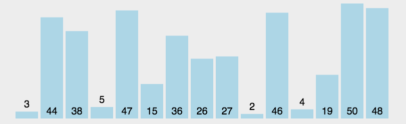

# 选择排序

## 原理图


## 核心思想
将左侧序列看成一个有序序列，每次将右侧循环中最小的元素元素插入到左侧序列末尾；

## 实现代码
```js
function selectionSort(array) {
    for (let i = 0; i < array.length - 1; i++) {
        let minIndex = i;
        for (let j = i + 1; j < array.length; j++) {
            if (array[j] < array[minIndex]) {
                minIndex = j;
            }
        }
        [array[minIndex], array[i]] = [array[i], array[minIndex]];
    }
}
```

## 复杂度
时间复杂度：`O(n2)`<br>
空间复杂度：`O(1)`