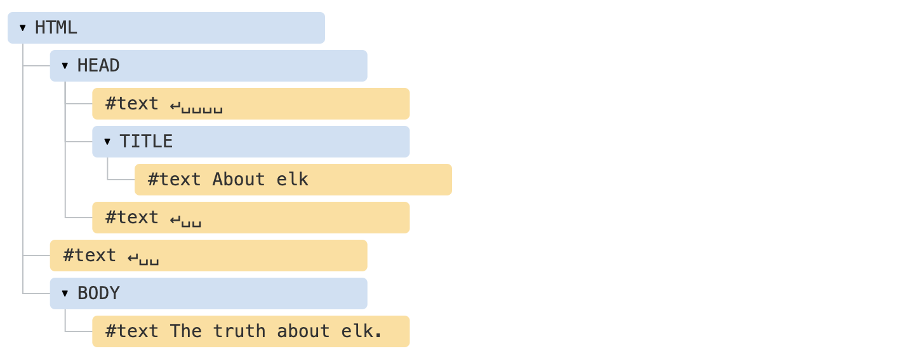

# DOM 树

## DOM 树概览
`HTML` 文本会被解析成 DOM 树，它是一个树状结构，`<html>` 是其根节点，`<body>`、`<head>` 则是其子项；
`DOM` 树的每一个节点都是一个 `对象`，当谈标签内的文本也是一个 `对象`；
所有的这些 `对象` 我们都可以通过 `JavaScript` 来访问，我们可以使用其相关的方法来修改页面；

## DOM 树结构
什么是 `DOM` 树？以下边的 HTML 为栗子：
```html
<!DOCTYPE HTML>
<html>
<head>
    <title>About elk</title>
</head>
<body>
    The truth about elk.
</body>
</html>
```

它所生成的 `DOM` 树如下图所示：


这里要注意文本节点中的特殊字符：
- 换行符：`↵`（在 JavaScript 中为 \n）
- 空格：`␣`

通常 `空格` 和 `换行符` 都是有效的字符，它们形成文本节点并成为 `DOM` 的一部分；<br>
但有两个 `顶级排除项` 是例外的：
1. 由于历史原因，`<head>` 之前的 `空格` 和 `换行符` 均被忽略；
2. 如果在 `</body>` 之后放置一些东西，那么它会被自动移动到 `body` 内，并处于 `body` 的最下方，这是因为 `HTML` 规范要求所有内容必须位于 `body` 内；


