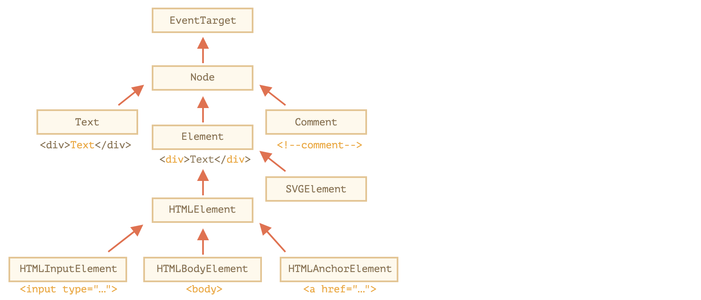

# DOM 节点和元素

## DOM 节点类
每个 DOM 都属于相应的内建类，如下图所示：


说明：
- **`EventTarget`**：是根的 `抽象类`，作为一个基础；它便于所有 `DOM` 节点支持 `事件（event）`；
- **`Node`**：是一个 `抽象类`，充当 DOM 节点的基础；它提供了树的核心功能，如 `parentNode`、`nextSibling`、`childNodes` 等；
- **`Element`**：是 `SVGElement`，`XMLElement` 和 `HTMLElement` 等 `特定类` 的 `基本类`；它提供了元素级的导航，如 `nextElementSibling`，`children`，以及`getElementsByTagName` 和 `querySelector` 这样的搜索方法；
- **`HTMLElement`**： 是所有 `HTML` 元素的 `基本类`；各种 `HTML` 元素均继承自它，如 `HTMLInputElement`、`HTMLBodyElement`、`HTMLAnchorElement` 等；

现在我们以 `<input>` 为栗子，看下它是怎么生成的：
- `EventTarget` 继承自 `Object`，因此拥有 `hasOwnProperty` 等这样的方法；
- `EventTarget` — 为事件提供支持；
- `Node` — 提供通用 `DOM` 节点属性；
- `Element` — 提供通用元素方法；
- `HTMLElement` — 它提供了通用的 `HTML` 元素方法（以及 `getter` 和 `setter`）；
- `HTMLInputElement` — 该类提供特定于输入的属性；

基于以上，我们看下能否对 HTML 元素调用一些方法：
```js
console.log(document.body.constructor.name) // HTMLBodyElement
alert( document.body ); // [object HTMLBodyElement]（这里隐式调用了 toString 方法）
console.log( document.body instanceof HTMLBodyElement ); // true
console.log( document.body instanceof HTMLElement ); // true
console.log( document.body instanceof Element ); // true
console.log( document.body instanceof Node ); // true
console.log( document.body instanceof EventTarget ); // true
```
> **Tip**：`console.dir(elem)` 将元素显示为 `DOM` 对象，非常适合探索其属性；

## DOM 节点类型
`nodeType` 属性提供了一种用来获取 `DOM` 节点类型的方法，它有一个数值型值；<br>
下面是一些常见的节点类型：
- 元素节点 — 1
- 属性节点 — 2
- 文本节点 — 3
- 注释节点 — 8
- document节点 — 9

## Node.nodeName 和 Element.tagName
对于一个 `DOM` 节点，我们都可以从它的 `nodeName` 或 `tagName` 属性读取标签名，但会有区别：
- `tagName` 属性仅适用于 `Element` 节点；
- `nodeName` 是为任意 `Node` 定义的，除了读取元素，还可以读取其他任意节点类型（如 `text`，`comment`，`document` 等）

如下代码：
```js
// 读取元素节点时
console.log(document.body.tagName) // BODY
console.log(document.body.nodeName) // BODY

// 读取非元素节点时
console.log(document.tagName) // undefined（不是一个元素）
console.log(document.nodeName); // #document
```

## innerHTML 和 outerHTML
#### Element.innerHTML
`innerHTML` 属性允许将元素中的 `HTML` 获取为字符串形式，当然也可以进行修改；
但是它会把元素的内容进行 `重写`，如下代码：
```js
elem.innerHTML += '<span>Hello World</span>'
```
`innerHTML +=` 实际上做了以下工作：
1. 移除旧内容；
2. 写入新的 `innerHTML`（新旧结合）；

#### Element.outerHTML
`outerHTML` 属性包含了元素的完整 `HTML`；
与 `innerHTML` 不同，写入 `outerHTML` 不会改变元素内容，而是在 `DOM` 中替换它；
但是有时候它也会让代码显得很奇怪，如下代码：
```html
<div>Hello, world!</div>
<script>
    let div = document.querySelector('div');

    div.outerHTML = '<p>A new element</p>'; // 替换元素为 <p>A new element</p>
    console.log(div.outerHTML); // 但是 div 变量没有变化，结果是 <div>Hello, world!</div>
</script>
```
上述代码实际上做了以下工作：
1. `div` 被从文档中移除；
2. 另一个 `HTML` 片段 `<p>A new element</p>` 被插入到其位置上；
3. `div` 仍拥有其旧的值；新的 `HTML` 没有被赋值给任何变量；

## TextNode.data
对于 `文本` 或 `注释` 节点来说，一般使用 `data` 属性来读取它的内容，如下代码所示：
```html
<body>
    Hello
    <!-- Comment -->
    <script>
        const text = document.body.firstChild;
        const comment = text.nextSibling;

        console.log(text.data); // Hello
        console.log(comment.data); // Comment
    </script>
</body>
```
> Tip：如上格式化的 `HTML` 代码中，`data` 属性中会包含 `空格` 和 `换行符`；

## Element.textContent
`textContent` 提供了对元素内的 `文本` 的访问权限：仅文本，去掉所有 `<tags>`；
如果我们想要以 `安全方式` 写入文本，就可以使用 `textContent` 来写入数据；

## Element.hidden
当被设置为 `true` 时，作用与 `display:none` 是相同的，一般可以用来 toggle 元素的 `显/隐` 状态；


