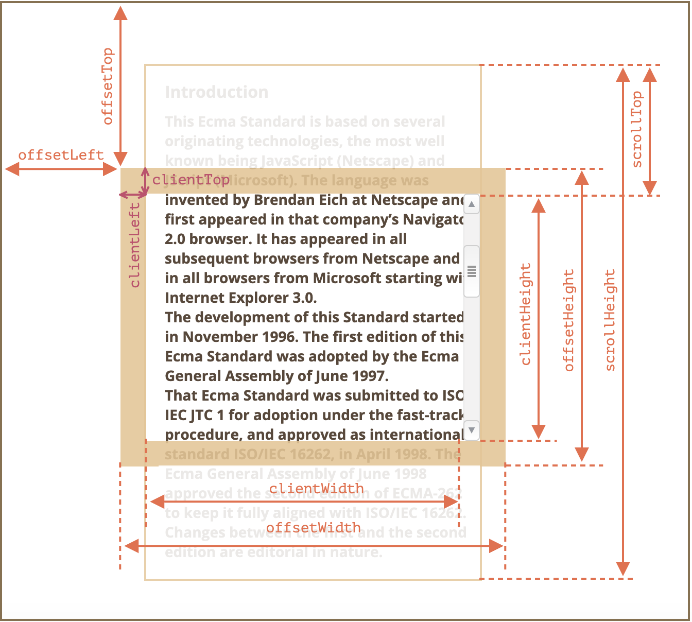

# DOM 元素大小和滚动

## 几何属性图

## 几何属性
### scrollWidth/scrollHeight
无滚动条的情况下，元素内容的总宽度/高度；

### scrollLeft/scrollTop
- `scrollLeft`：被隐藏在内容区域左侧的像素数（设置 scrollLeft 可改变元素的横向滚动位置）；
- `scrollTop`：被隐藏在内容区域上方的像素数（设置 scrollTop 可改变元素的纵向滚动位置）；

### clientWidth/clientHeight
元素 `content` 和 `padding` 所占据的空间大小，不包括边框、滚动条；

### clientLeft/clientTop
- `clientLeft`：元素左侧的 `border` 宽度；
- `clientTop`：元素顶部的 `border` 宽度；

### offsetWidth/offsetHeight
元素 `content`、`padding`、`border` 和 `可见垂直/水平滚动条的宽度` 所占据的空间大小；

### offsetLeft/offsetTop
- `offsetLeft`：元素的左外边框至包含元素的左内边框之间的像素距离。
- `offsetTop`：元素的上外边框至包含元素的上内边框之间的像素距离。

### offsetParent
最接近的 `CSS` 定位的祖先，或者是 `td`，`th`，`table`，`body`；

## 滚动方法
### window.scrollTo(pageX,pageY)
相对于 `window` 的绝对坐标；

### window.scrollBy(x,y)
相对当前位置进行滚动；

### elem.scrollIntoView(top)
滚动使得 `elem` 可见：
- `top` 为 `true`，则 `elem` 与 窗口的顶部对齐；
- `top` 为 `false`，则`elem` 与 窗口的底部对齐；