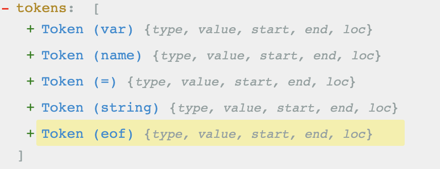

# AST
### 什么是 AST？
`AST`（全称 `Abstract Syntax Tree`），一般称为 `抽象语法树`，是源代码语法结构的抽象表示；

### AST 解析过程
一段 `JS` 代码是怎样被解析成 `AST` 的呢？主要分为两个步骤：
1. **词法分析**

将 `JS` 字符串分解成多个 `token`（词法单元），如下边的一个栗子：
```js
var name = 'Sky'
```
上边的代码会被解析器（如 `babylon7`）所解析，分词结果为：



2. **语法分析**

这个阶段会将 `tokens`（词法单元流）转换成一个由元素逐级嵌套组成的语法结构树，这就是 `AST`；
```js
var name = 'Sky'
```
还是这个例子，最终生成的 `AST` 如下（省略了一些其他信息，如 start、end、loc 等）：
```json
{
    "program": {
        "type": "Program",
        "body": [
            {
                "type": "VariableDeclaration",
                "kind": "var",
                "declarations": [
                    {
                        "type": "VariableDeclarator",
                        "id": {
                            "type": "Identifier",
                            "name": "name"
                        },
                        "init": {
                            "type": "StringLiteral",
                            "value": "Sky"
                        }
                    }
                ],
                "kind": "var"
            }
        ]
    }
}
```
以上结果可以前往 [AST Explorer](https://astexplorer.net/) 进行验证；